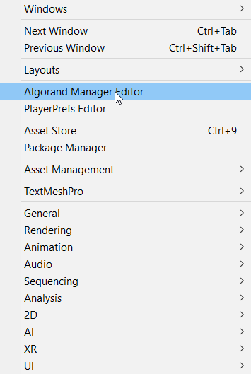
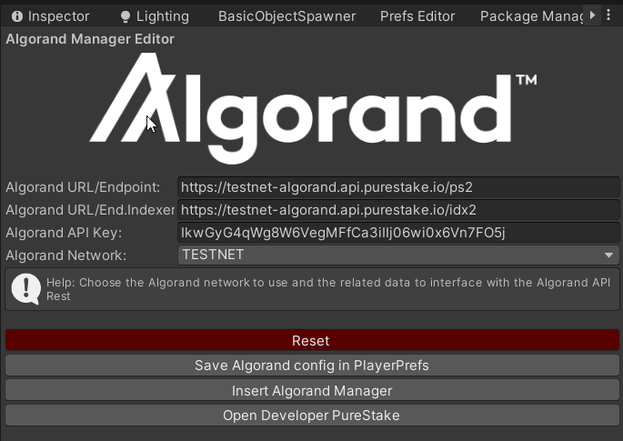
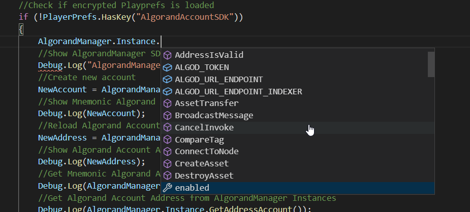

# Using AlgorandUnity SDK

## Introduction

AlgorandUnity SDK is a comprehensive set of tools that will bring the power of Algorand blockchain within Unity to empower developers to develop Algorand features inside their Unity projects. 

With both the C# SDK (.NET platform) and the interface to the Algorand BlockChain (https://github.com/RileyGe/dotnet-algorand-sdk),  Unity developers can exploit to integrate the power of Algorand within their work. 
	The Unity Package will contain:

- **Scripts**: Tailored scripts in C# for fast development, to use within a Unity project.
- **Editor**: Editor Script to add Unity UI Editor window with Algorand Manager helping Unity developer to configure Algod/PureStake URL Endpoint, Create Wallet/Address, etc.
- **Resources**: Public domain resources like materials, textures, meshes, to use with the SDK or for a Unity Developer project.
- **Plugins**: All .NET DLL binaries from Algorand C# SDK, useful for cross-platform development, so that a Unity runtime build can be created.
- **Prefabs**: Ready-to-use Algorand “prefabs” to be automatically or manually integrated into Unity scenes.
- **Scene Examples**: 1 or 2 scenes sample tutorials: How to use Algorand in Unity 3D; basic sample game which uses ALGO tokens, ASA Fungible and Not Fungible Tokens, showing the transfer of Unity Assets via an Algorand transaction in Algorand of ASA NFTs.
- **Documentations**: All documentation in MarkDown and PDF format that briefly describes how the SDK works and how to use the included examples.

The whole package will be compatible with the management system used by Unity, as described in the following document: https://docs.unity3d.com/Packages/com.unity.package-manager-ui@1.8/manual/index.html
and it will also be available through the Assets Store: https://unity3d.com/asset-store/sell-assets

The entire project will be released under the MIT license: 
https://opensource.org/licenses/MIT

Open source components and libraries used in the project:

- https://github.com/UnityCommunity/UnitySingleton (MIT)
- https://github.com/TakuKobayashi/UnityCipher (MIT)
- https://github.com/TakuKobayashi/UnityThreadQueue (MIT)
- https://gist.github.com/manhunterita/4a270cb3e56ac4b634eae59a9048c121 (MIT)

Four main features will be developed:

- Algorand Account Management
- Payment transaction management in Algorand
- ASA Trading Transaction Management
- Basic search for Transaction, Address and Block using Explorer API REST, like in:
https://algoexplorer.io/api-dev/indexer-v2
https://developer.purestake.io/home

List of all C# property, methods and events in Algorand SDK: [https://rileyge.github.io/dotnet-algorand-sdk/api/index.htm](https://rileyge.github.io/dotnet-algorand-sdk/api/index.html)

### Algorand Account Management
The centralized AlgorandManager SDK developed for Unity will allow the complete management of the Account of the Algorand BlockChain:

- Initialization and creation of a new valid offline local Algorand Account 
- Initialization and creation of an online Algorand Account using external KMD endpoint
- Verification of the formal correctness of an Algorand address
- Safe saving in the basic game configurations of the created account
- Retrieval of all essential information: balance, public address, etc …
- Procedure for deleting an Algorand Account and related deletion of the configuration in Unity.

### Payment transaction management in Algorand
Mandatory features to use Algorand within a gaming project include:

- Configuration of a specific free account for the developer at the address (https://www.purestake.com/technology/algorand-api/) and configuration, through a specific Unity Editor, of parameters such as choice of network to operate on (MAINNET, BETANET, TESTNET), endpoint URL, token-api, etc.
- Creation, signature and propagation through a free PureStake account of payment transactions in Algo
- Verification of the transaction and the related block and optional retrieving of its data from the BlockChain
- Complete management of the main Unity events using template scripts to add on GameObject or using Prefabs.

### ASA Trading Transaction Management
As in the Algorand Payment Transactions, the following will be available for ASAs:

- Create an Asset, FT and NFT 
- Modify an Asset, FT and NFT
- Receive an Asset, FT and NFT
- Transfer an Asset, FT and NFT
- Freeze an Asset, FT and NFT
- Revoke an Asset, FT and NFT
- Destroy an Asset, FT and NFT

## Retrieve Asset Information

- Basic search of Transaction, Address and Block using API REST of Explorer.
It is essential to give the possibility to the single Unity developer to be able to search through the configured Purestake Explorer:
- Search for all information starting from a Transaction ID
- Search for all transactions starting from an Algorand Address
- Search for all information starting from ASA ID
- Search for all transactions starting from ASA ID


## How to install AlgorandUnity SDK

To install SDK you can use different methods:

- Using Unity Asset Store.
- Download .unitypackage from https://github.com/Vytek/AlgorandUnitySDK and import using "Import Custom Package". (See: [Link](https://docs.unity3d.com/Manual/AssetPackagesImport.html)).
- Download AlgorandUnitySDK-master.zip and extract to your project assets.

## How to enable AlgorandUnity SDK Manager Editor 

After loading the AlgorandUnitySDK, a new item entitled "Algorand Manager Editor" will be automatically loaded in the main Unity Window Menu. Selecting it will create its floating window.



**It is necessary to set a new token and create a new account of the PureStake service or set URI of your ALGOD/IDX2 Daemons.**



## How to use Algorand Manager Editor

- **Reset**: Reset the actual configuration with default parameters.
- **Save Algorand config in PlayerPrefs**: After filling in all the necessary fields you can save the configurations in the PlayerPrefs so that they can be used later.
- **Insert Algorand Manager**: press to insert AlgorandManager Prefab in your open Scene Hierarchy. 
- **Open Developer PureStake**: press to open https://developer.purestake.io/ and SignUp for Free/Pay Account to use with AlgorandUnitySDK.

## How to use Algorand Manager in your Unity Scripts

After installing the Prefab AlgorandManager in the scene you can use it for development. Installation is possible in two ways:

- By manually adding the Prefab AlgorandManager (check Prefabs directory);
- using the "Insert Algorand Manager" option of the Algorand Manager Editor.

### Algorand Unity Scripts Example

To see the list of properties, methods and events associated with AlgorandManager, refer to the Documentation folder.
If you want to create a C# script in Unity please see this guide:
[https://docs.unity3d.com/Manual/CreatingAndUsingScripts.html](https://docs.unity3d.com/Manual/CreatingAndUsingScripts.html)



Below is a list with code examples of the methods and properties that the AlgorandManager instance makes available to the Unity developer:

```cs
//Show AlgorandManager SDK Version
Debug.Log("AlgorandManager SDK Version: "+AlgorandManager.Instance.Version());
```

```cs
//Create new account
NewAccount = AlgorandManager.Instance.GenerateAccount();
//Show Mnemonic Algorand Account Passphrase
Debug.Log(NewAccount);
```

**WARNING: The GenerateAccount() method returns a Pass Phrase in BIP 39 string format. Keep it secret!**

```cs
//Reload Algorand Account using Passphrase in AlgorandManager Instance
NewAddress = AlgorandManager.Instance.LoadAccountFromPassphrase(NewAccount);
//Show Algorand Account Address
Debug.Log(NewAddress);
```

```cs
//Get Mnemonic Algorand Account BIP 39 Passphrase 
Debug.Log(AlgorandManager.Instance.GetMnemonicPassphrase());
```

**WARNING: The GetMnemonicPassphrase() method returns a Pass Phrase in BIP 39 string format. Keep it secret!**

```cs
//Get Algorand Account Address from AlgorandManager Instances
Debug.Log(AlgorandManager.Instance.GetAddressAccount());
```

```cs
//Verify Algorand Account Address passed
Debug.Log("Valid Algorand Address: " + AlgorandManager.Instance.AddressIsValid(NewAddress));
```

There is an overload of this method with the possibility of further encryption through a password to be asked to the user at runtime. The result of the encryption is not compatible with methods that do not have this additional parameter.

```cs
//Save Algorand Account using Passphrase in AlgorandManager Instance in encrypted PlayerPrefs
Debug.Log("Save Algorand Account in encrypted PlayerPrefs: " + AlgorandManager.Instance.SaveAccountInPlayerPrefs(NewAccount));
```

There is an overload of this method with the possibility of further encryption through a password to be asked to the user at runtime. The result of the encryption is not compatible with methods that do not have this additional parameter.

```cs
//Load Algorand Account from encrypted PlayerPrefs
NewAddress = AlgorandManager.Instance.LoadAccountFromPlayPrefs();
```

If you want to change the saved encrypted account you have to delete it explicitly using method*DeleteAccountFromPlayerPrefs()* and generating a new Algorand account and then save it.

```cs
//Show  ALGOD/PureStake URL saved in PlayerPrefs
Debug.Log("URL ENDPOINT: "+AlgorandManager.Instance.ALGOD_URL_ENDPOINT);
```

There are also:

- ALGOD_TOKEN
- ALGOD_URL_ENDPOINT_INDEXER

```cs
//Get Wallet Amount of Algorand Address Account
var amountnow = AlgorandManager.Instance.GetWalletAmount(AlgorandManager.Instance.ALGOD_URL_ENDPOINT, AlgorandManager.Instance.ALGOD_TOKEN, AlgorandManager.Instance.GetAddressAccount());
Debug.Log("MicroAlgos: "+amountnow);
```

```cs
//Get Healthy ( Free 1 req/ 1 sec Purestack)
Debug.Log("Algorand Health: "+AlgorandManager.Instance.GetHealth(AlgorandManager.Instance.ALGOD_URL_ENDPOINT_INDEXER, AlgorandManager.Instance.ALGOD_TOKEN));
```

```cs
//Get Account Amount
Debug.Log("Account Amount (KV2XGKMXGYJ6PWYQA5374BYIQBL3ONRMSIARPCFCJEAMAHQEVYPB7PL3KU): "+
AlgorandManager.Instance.GetAccount(AlgorandManager.Instance.ALGOD_URL_ENDPOINT_INDEXER,
AlgorandManager.Instance.ALGOD_TOKEN,
"KV2XGKMXGYJ6PWYQA5374BYIQBL3ONRMSIARPCFCJEAMAHQEVYPB7PL3KU"), false);
```

```cs
//GetAsset Info
var jsonResult = AlgorandManager.Instance.GetAsset(AlgorandManager.Instance.ALGOD_URL_ENDPOINT_INDEXER, 
AlgorandManager.Instance.ALGOD_TOKEN,
15187601);
//Using simple JSON Parser: https://wiki.unity3d.com/index.php/SimpleJSON
var N = JSON.Parse(jsonResult);
//Show Asset Total Example
Debug.Log("Asset Total: "+N["asset"]["params"]["total"]);
//Show Creator Example
Debug.Log("Creator: "+N["asset"]["params"]["creator"]);
```

```cs
//Search last 5 Transactions
var jsonResult = AlgorandManager.Instance.SearchTransactions(AlgorandManager.Instance.ALGOD_URL_ENDPOINT_INDEXER, 
AlgorandManager.Instance.ALGOD_TOKEN, "KV2XGKMXGYJ6PWYQA5374BYIQBL3ONRMSIARPCFCJEAMAHQEVYPB7PL3KU");
//Using simple JSON Parser: https://wiki.unity3d.com/index.php/SimpleJSON
var N = JSON.Parse(jsonResult);
//Debug.Log(jsonResult);
//Show Current Round Example
Debug.Log("Current Round: "+N["current-round"]);
```

```cs
//Transfert Algo from your Accout to another Algorand Address 
Debug.Log("TxID: "+AlgorandManager.Instance.MakePaymentTransaction(AlgorandManager.Instance.ALGOD_URL_ENDPOINT, 
AlgorandManager.Instance.ALGOD_TOKEN,
"KV2XGKMXGYJ6PWYQA5374BYIQBL3ONRMSIARPCFCJEAMAHQEVYPB7PL3KU", 0.01, "Test using AlgorandUnitySDK: "+AlgorandManager.Instance.Version()));
```