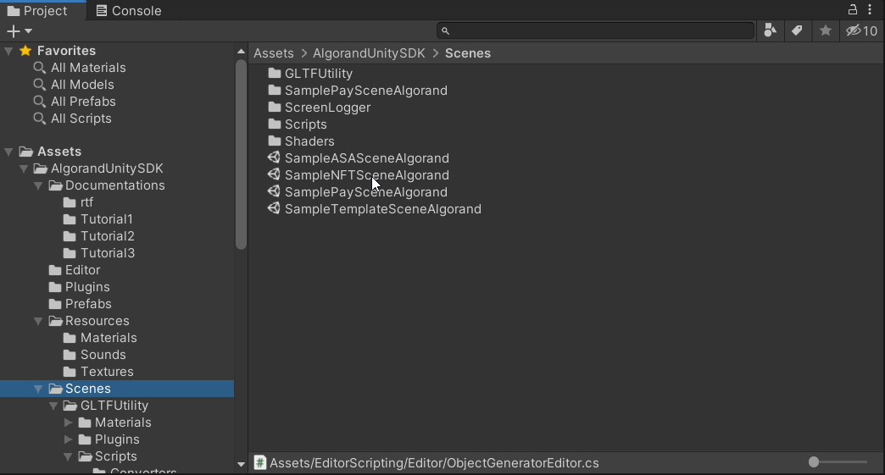
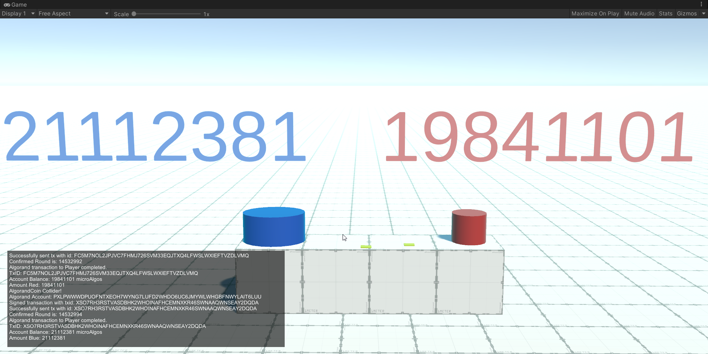
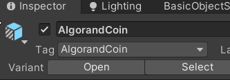
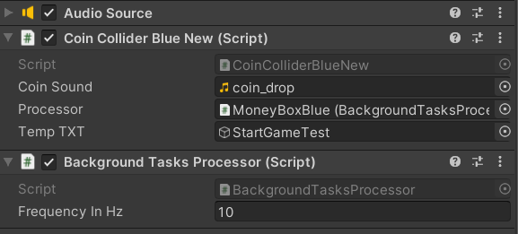
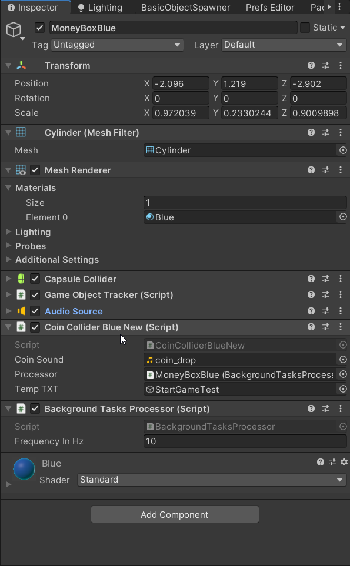

# Introduction

There are several scenes in the scenes directory of the project. This document will deal with:



Click and load "SamplePaySceneAlgorand".

## Code analysis

Tha main code example is the script: *StartGameTest.cs*

First it is checked if there is a "AlgorandAccountSDK" key and therefore it has been saved.

```csharp
if (!PlayerPrefs.HasKey("AlgorandAccountSDK"))
```
If check is true, it will load and show in Debug.Log the account Address used and its mnemonic key in BIP 39 format. 

```csharp
//Load Algorand Account from encrypted PlayerPrefs
NewAddress = AlgorandManager.Instance.LoadAccountFromPlayerPrefs();
//Show Algorand Account Address
Debug.Log(NewAddress);
//Get Mnemonic Algorand Account Passphrase 
Debug.Log(AlgorandManager.Instance.GetMnemonicPassphrase());
NewAccount = AlgorandManager.Instance.GetMnemonicPassphrase();
//Get Algorand Account Address from AlgorandManager Instances
Debug.Log(AlgorandManager.Instance.GetAddressAccount());
//Verify Algorand Account Address passed
Debug.Log("Valid Algorand Address: " + AlgorandManager.Instance.AddressIsValid(NewAddress));
//Show URL ENDPOINT ALGOD
Debug.Log("URL ENDPOINT: " + AlgorandManager.Instance.ALGOD_URL_ENDPOINT);
//Show URL ENDPOINT INDEXER
Debug.Log("URL ENPOINT INDEXER: " + AlgorandManager.Instance.ALGOD_URL_ENDPOINT_INDEXER);
//Show Token Used
Debug.Log("Token Used: " + AlgorandManager.Instance.ALGOD_TOKEN);
```

Next we will start the background query via UnityThreadQueue of Algorand addresses so as not to interrupt the execution of Unity's MainThread by modifying the Text Pro at runtime.

Link to UnityThreadQueue: 

```csharp

    //Get Balances Account
    mTextRed.SetText(AmountRed.ToString());
    Debug.Log("Text: "+ mTextRed.text); 
    //mTextBlue =  GameObjectTracker.AllGameObjects [1].gameObject.GetComponent<TextMeshPro>();
    mTextBlue.SetText(AmountBlue.ToString());
    Debug.Log("Text: "+ mTextBlue.text); 
    UnityThreadQueue.Instance.Enqueue(() =>
    {
        //Update Red Balance
        AmountRed = AlgorandManager.Instance.GetWalletAmount(
            AlgorandManager.Instance.ALGOD_URL_ENDPOINT,
            AlgorandManager.Instance.ALGOD_TOKEN,
            "PVT67ZSBADU5ATXRIYBRIDBWSOIJOJJR73FJPCUFSKPHXI4M7PIRS5SRRI"
        );
        //Update blue Balance
        AmountBlue = AlgorandManager.Instance.GetWalletAmount(
            AlgorandManager.Instance.ALGOD_URL_ENDPOINT,
            AlgorandManager.Instance.ALGOD_TOKEN,
            "F52PF5E2GNMUZN2JYPXS4ANMXUY23F6RVE6VEJH4ZZYHMDUZPYUFKWYX6Q"
        );
        Debug.Log("Amount Blue: "+AmountBlue);
        Debug.Log("Amount Red: "+AmountRed);
    });
```

```csharp
void Update()
{
    //if ((AmountRed == 0) || (AmountBlue == 0))
    {
        mTextRed.text = AmountRed.ToString();
        mTextBlue.text = AmountBlue.ToString();
    } 
}
```

**Dragging and dropping the "AlgorandCoin" using mouse button onto the blue or red Money Box /Jar will trigger an Algorand payment transaction and play a related sound. When the transaction is completed and confirmed the amount at the top of the cylinder will be updated.**



As you can see from the Inspector, both the red jar and the blue moneybox/jar have a script that is triggered when the GameObject AlgoranCoin collides with one of the two jars.


See:
 
- "Is Trigger" property flagged on Jar GameObject.
- "Tag" property set to "AlgorandCoin".



It is very important to understand that you need a system that starts the calls to the various Algorand services in the background and in completely asynchronous mode so as not to interrupt and create problems in the execution of the MainThread of Unity. For this purpose use *BackGroundTasksProcessor.cs* script.



```csharp
void OnTriggerEnter(Collider col)
{
    if (col.tag == "AlgorandCoin")
    {
        Destroy(col.gameObject);
        //Play Sound
        _audioSource.clip = CoinSound;
        _audioSource.Play();
        Debug.Log("AlgorandCoin Collider!");
        //Doing Transaction
        //Using BackgroundTasksProcessor
        Processor.Process(
            () =>
            {
                //Do here Algorand Transaction
                TxIDPayment = AlgorandManager.Instance.MakePaymentTransaction(
                    AlgorandManager.Instance.ALGOD_URL_ENDPOINT,
                    AlgorandManager.Instance.ALGOD_TOKEN,
                    "F52PF5E2GNMUZN2JYPXS4ANMXUY23F6RVE6VEJH4ZZYHMDUZPYUFKWYX6Q",
                    0.01,
                    "Test Tx for Payment: " + DateTime.Now.ToString()
                );
                Debug.Log("TxID: " + TxIDPayment);
                //Update Balance
                Amount = AlgorandManager.Instance.GetWalletAmount(
                    AlgorandManager.Instance.ALGOD_URL_ENDPOINT,
                    AlgorandManager.Instance.ALGOD_TOKEN,
                    "F52PF5E2GNMUZN2JYPXS4ANMXUY23F6RVE6VEJH4ZZYHMDUZPYUFKWYX6Q"
                );
                return Amount;
            },
            (result) =>
            {
                Debug.Log("Amount Blue: " + result);
                //Update Blue Balance
                tempTXT.GetComponent<StartGameTest>().AmountBlue = Amount;
            }
        );
    }
}
```

See the complete GameObject MoneyBox (Blue Or Red)/Jar configuration on Unity Inspector:

